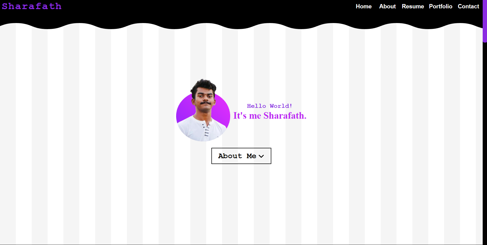
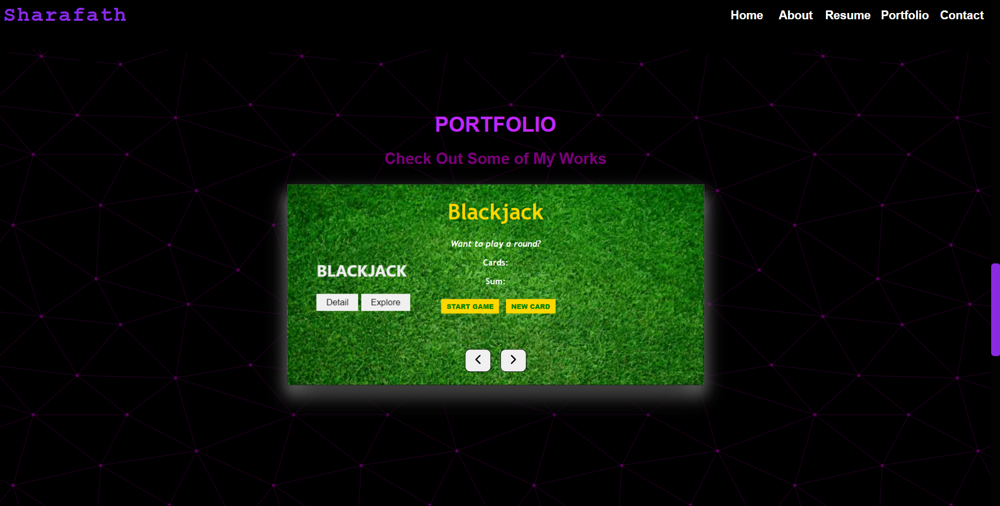

# 🖥️ My Portfolio

👋 Welcome to my personal portfolio website! This project highlights my 💻 technical skills, 🛠️ completed projects, and 🧳 professional experiences as a 👨‍💻 developer. It serves as a comprehensive resource to showcase my capabilities and journey in the tech field.

## 🌐 Live Demo

🔗 Check out my portfolio here: [My Portfolio](https://sharafath07.github.io/My-Portfolio/)

---

## 📂 About the Portfolio

This portfolio is designed to provide:

- ✨ **About Me**: An overview of my background and professional interests.
- 🛠️ **Skills**: A summary of the technologies and tools I have mastered.
- 🌟 **Projects**: A curated list of my notable projects, complete with live demos and GitHub links.
- 📞 **Contact**: Direct ways to connect with me for opportunities or collaborations.

---

## 🛡️ Features

### 🖌️ **Modern Design**
- 📱 A clean, responsive layout that adapts seamlessly to any device (desktop, tablet, or mobile).
- 🧭 An intuitive user interface that ensures easy navigation.

### 💫 **Interactive Elements**
- ✨ Animations and hover effects to enhance user engagement.
- 🖱️ Interactive sections for a dynamic and professional presentation.

### 🔀 **Dynamic Content**
- 🗂️ A projects section featuring live previews and GitHub repository links for detailed exploration.

---

## 🛠️ Technologies Used

- 🌐 **HTML5**: For structuring the website’s content.
- 🎨 **CSS3**: For styling and ensuring a responsive, modern design.
- ⚡ **JavaScript**: For interactive functionality and a seamless user experience.

---

## 🖼️ Screenshots

### 🏠 Homepage


### 📦 Projects Section


---

## 📖 How to Use

1. 🌍 Visit the live site: [My Portfolio](https://sharafath07.github.io/My-Portfolio/).
2. 🔍 Use the menu to navigate through sections or scroll for a smooth browsing experience.
3. 🖱️ Click on project links to view live demos and access source code repositories.

---

## 🛠️ Installation (For Local Use)

1. 🛠️ Clone the repository:
   ```bash
   git clone https://github.com/sharafath07/My-Portfolio.git
   ```
2. 📂 Navigate to the project folder:
   ```bash
   cd My-Portfolio
   ```
3. 🌐 Open the `index.html` file in your browser to view the website locally:
   ```bash
   open index.html
   ```

---

## 🚀 Future Enhancements

- 📝 Add a blog section to share technical articles and tutorials.
- 🌙 Implement a dark mode toggle for improved accessibility and user preference.
- 📧 Integrate a backend-supported contact form for seamless communication.

---

## 🤝 Contributing

Contributions are welcome! If you have ideas for improvements or new features, feel free to fork the repository and submit a pull request.

---

## 📬 Contact

I’d love to hear from you! Reach out through:

- 📧 **Email**: sharafathahammed112@gmail.com
- 🐙 **GitHub**: [Sharafath07](https://github.com/sharafath07)
- 💼 **LinkedIn**: [Sharafath Ahammed V](https://linkedin.com/in/your-profile)

---


🙏 Thank you for visiting my portfolio! 😊

